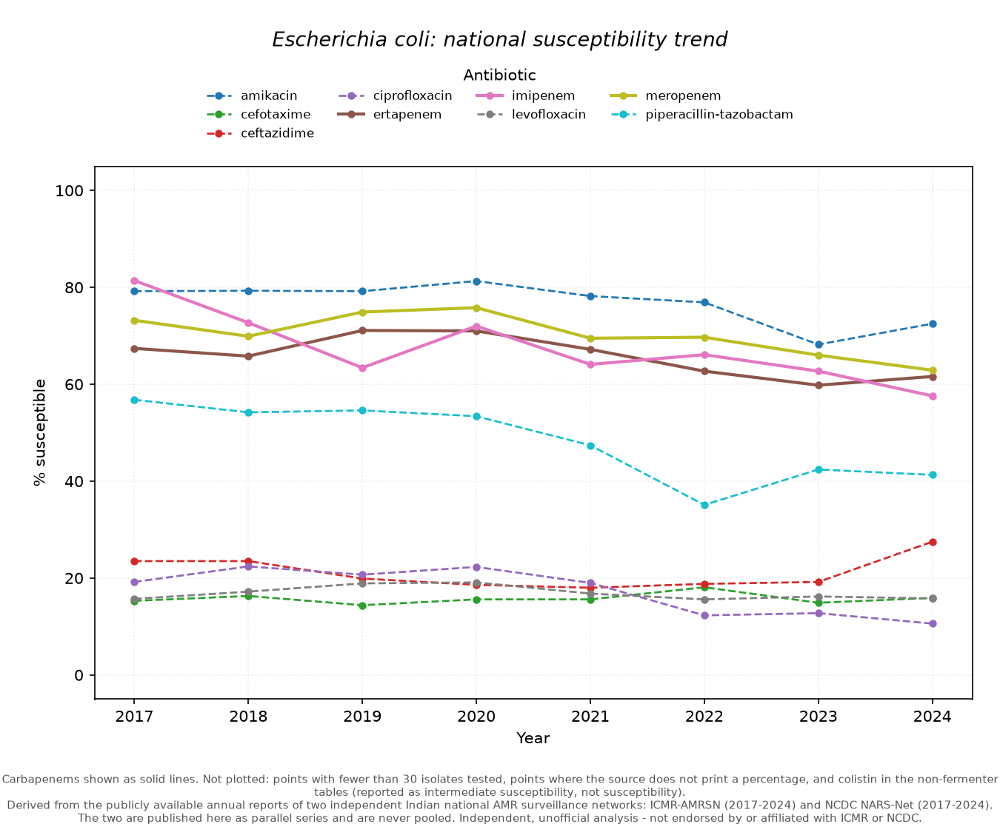
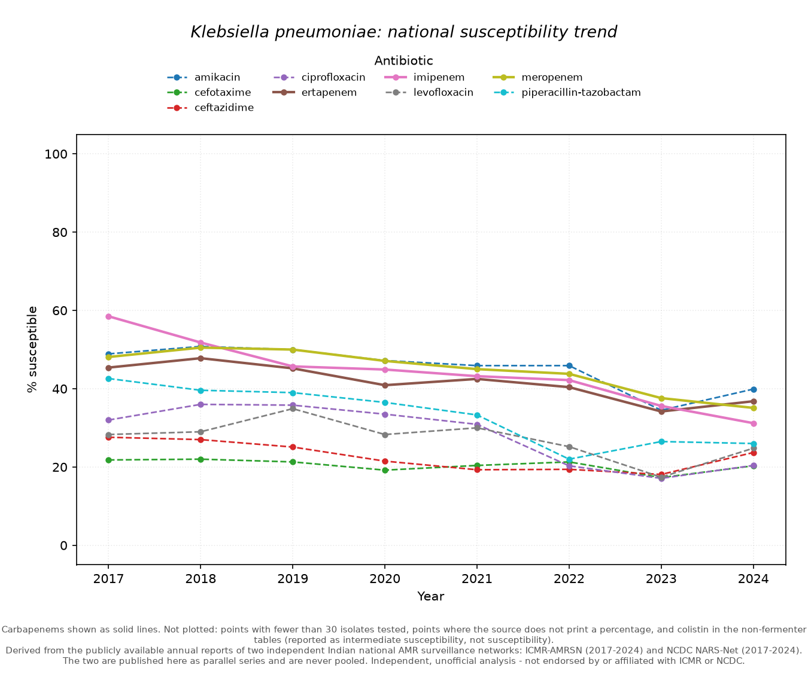
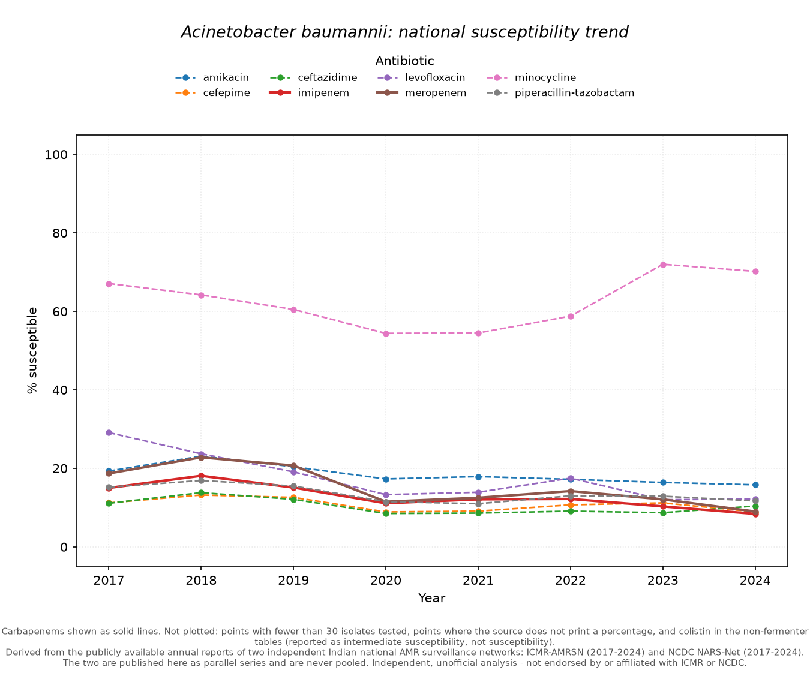
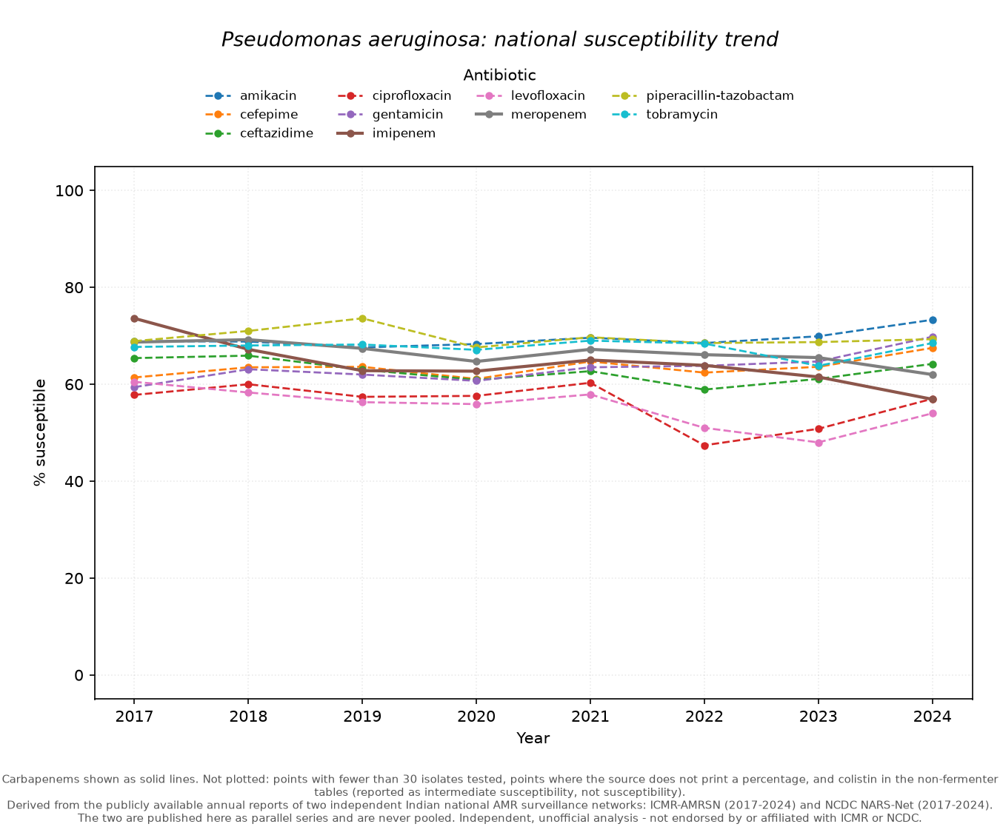
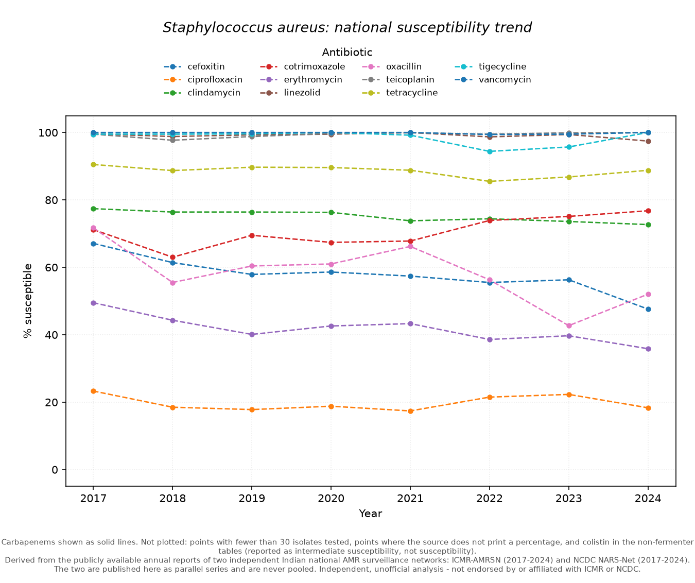
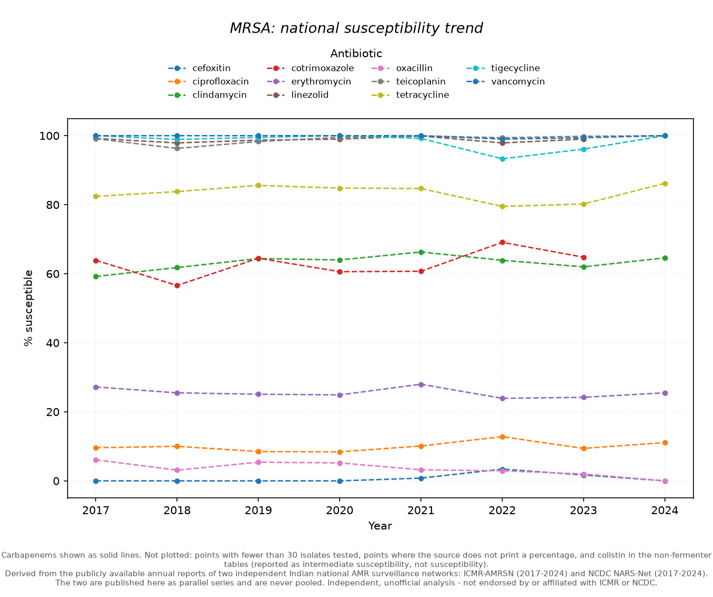

# ICMR-AMRSN Trend Tracker

Extracts India's national antimicrobial susceptibility trends from the ICMR
Antimicrobial Resistance Surveillance Network (AMRSN) annual reports, and
publishes them as structured, fully provenance-annotated data.

> Derived from publicly available ICMR AMRSN annual reports (2017–2024).
> Independent, unofficial analysis — not endorsed by or affiliated with ICMR.

**Author:** Yashita Thakur ([ORCID 0009-0004-7895-5250](https://orcid.org/0009-0004-7895-5250))
**Code licence:** MIT · **Data licence:** [see `DATA_LICENSE.md`](DATA_LICENSE.md)

---

## What this is

ICMR publishes AMRSN surveillance results as annual report PDFs. There is
no API, no CSV, and no bulk download; isolate-level data is not part of the
public release. This repository turns the published national trend tables into a clean,
citable dataset, where **every single number carries the report edition and
table number it came from**, so any value can be traced back to a specific
printed table and checked by hand.

Running antimicrobial-resistance surveillance across a national network of this
many laboratories, sustained over several years and published in a consistent
annual form, is a hard operational and data-management problem; the extraction
notes in this repository sit inside that context and are not a critique of it.
NCDC's NARS-Net published its 2020 report from inside the pandemic, and said
plainly why that year's isolate counts were down.

### What this is **not**

- **Not community prevalence.** These are isolates from tertiary-care
  laboratories in the AMRSN network — a heavily selected, hospital-skewed
  population. They do not describe resistance in the general population.
- **Not patient-level data.** ICMR does not release isolate-level records.
- **Not a national burden or incidence estimate.** Denominators are "isolates
  tested for this drug", not people, not infections.
- **Not a pooled cross-network figure.** ICMR AMRSN and NCDC's NARS-Net (which
  feeds WHO GLASS) are **different networks** with different participating
  sites. This repository carries both, in separate files with separate schemas —
  `amr_trends.csv` for AMRSN, `narsnet_trends.csv` for NARS-Net — and they are
  never combined. They do not even share a comparison value: AMRSN publishes
  **% susceptible**, NARS-Net publishes **% resistant**, and AMRSN publishes no
  % intermediate for *E. coli* or *S. aureus*, so an AMRSN % resistant cannot be
  computed. Read them as parallel series, never as one.
- **Not an official ICMR or NCDC product.** Where this dataset and the
  corresponding published report differ, **the published report is
  authoritative** and the difference is a limitation of this extraction —
  please open an issue.

---

> **Scope and maintenance.** Data is current through the ICMR AMRSN **8th
> edition (2024)**. This repository is *not* actively maintained against future
> editions — for anything published after 2024, check the
> [ICMR AMRSN site](https://iamrsn.icmr.org.in/) directly. Stating the boundary
> is preferable to implying a currency this project does not have.

## Coverage

| | |
|---|---|
| **Organisms** | *E. coli*, *K. pneumoniae*, *A. baumannii*, *P. aeruginosa*, *S. aureus*, MRSA |
| **Chapters** | Enterobacterales, non-fermenting Gram-negative bacilli, staphylococci |
| **Specimens** | All samples (each chapter's own exclusions; never urine-only tables) |
| **Years** | 2017–2024 |
| **Report editions** | 2022 (6th), 2023 (7th), 2024 (8th) |
| **Rows** | 1,286 |

Each edition carries its own 8-year retrospective trend table, so the same
calendar year is covered by up to three independent editions — which is what
makes revision detection possible (see below).

**Panels are per organism, not per chapter**, and are read from each table
rather than assumed:

| Organism | Drugs | Notes |
|---|---|---|
| *E. coli*, *K. pneumoniae* | 10 | |
| *A. baumannii* | 9 | minocycline; no gentamicin/tobramycin/ciprofloxacin |
| *P. aeruginosa* | 11 | gentamicin, tobramycin, ciprofloxacin; no minocycline |
| *S. aureus* | 11 | Gram-positive panel |
| MRSA | 9 | omits cotrimoxazole and linezolid |

Neither non-fermenter is tested against ertapenem or cefazolin. Daptomycin
appears in the specimen-wise staphylococcal tables but in neither yearly trend
table, so it is absent here.

**Regional Centre breakdowns** are covered separately by V2, for the three
organisms that have an RC-wise susceptibility table — see
[Regional Centre breakdowns](#regional-centre-breakdowns-v2).

Out of scope: specimen-type splits, OPD/ward/ICU splits, non-priority
pathogens, resistance-gene data.

---

## Quick start

```bash
pip install -r requirements.txt
```

```bash
python -m src.build_dataset --fetch
```

That downloads the three report PDFs to `data/raw/`, extracts the trend tables,
validates against known reference values, writes `data/processed/`, and prints
any places where editions report the same year differently.

```bash
python -m src.build_rc_dataset
```

That extracts the V2 Regional Centre breakdowns from the same PDFs and writes
`data/processed/amr_rc_trends.{csv,json}`, `rc_panel.json` and
`rc_revisions.json` (see [Regional Centre breakdowns](#regional-centre-breakdowns-v2)).

```bash
pytest -v
```

```bash
python viz/trend_charts.py --revisions
```

---

## Outputs

| File | Contents |
|---|---|
| `data/processed/amr_trends.csv` | One row per organism × antibiotic × year × report edition |
| `data/processed/amr_trends.json` | The same, as JSON |
| `data/processed/revisions.json` | Where editions report the same year differently |
| `data/processed/extraction_report.json` | Run metadata: sources, hashes, what parsed |
| `docs/figures/*.png` | Trend charts |
| `data/processed/amr_rc_trends.{csv,json}` | **V2** — one row per organism × Regional Centre × antibiotic × edition ([details](#regional-centre-breakdowns-v2)) |
| `data/processed/rc_panel.json` | **V2** — the RC set each edition printed, and what changed between editions |
| `data/processed/rc_revisions.json` | **V2** — cross-edition RC revision check (near-empty by design) |
| `data/processed/rc_extraction_report.json` | **V2** — RC run metadata |













### Schema

```json
{
  "organism": "Klebsiella pneumoniae",
  "antibiotic": "meropenem",
  "year": 2024,
  "susceptible_n": 4276,
  "tested_n": 12189,
  "susceptible_pct": 35.1,
  "source_report_year": 2024,
  "source_table": "Table 2.7",
  "source_url": "https://www.icmr.gov.in/...",
  "extracted_date": "2026-08-26",
  "reported_pct": 35.1,
  "computed_pct": 35.08,
  "flags": ""
}
```

`year` is the calendar year the measurement describes. `source_report_year` is
the edition it was read from. **Keeping these separate is the point** — it is
what lets the same year appear three times, once per edition, and differ.

**`susceptible_pct` is the percentage ICMR printed, and nothing else.** Where
the source does not print one — it shows `(-)` for cells like `*0/8`, since a
proportion from eight isolates would not be a stable estimate — this field is
**null**, even though the counts are published. Deriving `0.0%` from `0/8` and
presenting it as a susceptibility figure would introduce a number the source
itself does not report. `computed_pct` carries `susceptible_n / tested_n` for
anyone who wants it, clearly labelled as derived rather than reported.

`reported_pct` and `computed_pct` should agree to within rounding. Any row
where they do not is flagged, not dropped.

#### `flags` values

| Flag | Meaning |
|---|---|
| `low_isolate_count_asterisk` | the source marks this cell with `*` (very few isolates) |
| `pct_suppressed_in_source` | the source shows `(-)` in place of a percentage for this cell |
| `no_isolates_tested` | Denominator is 0 — the drug was not tested at all that year |
| `pct_mismatch(...)` | printed % and n/N do not fully reconcile (>0.15 pp) — check against the source before use |
| `label_footnote_asterisk` | The drug's row label carries a `*` footnote in the source |
| `colistin_is_intermediate_susceptibility` | **Not a susceptibility figure** — see below |
| `antibiotic_assigned_positionally` | Label column failed to extract; drug identity inferred from row order. **Audit before use.** |

In the current dataset (1,286 rows) no row carries
`antibiotic_assigned_positionally` — every antibiotic label was read from the
table rather than inferred. Exactly **3 rows carry `pct_mismatch`**, and in all
three the printed figures themselves do not fully reconcile — this is not an
extraction failure (see [Reconciling printed values](#reconciling-printed-values)).

### Colistin is not what it looks like

Both non-fermenter tables footnote colistin:
*"\*Colistin represents percentage intermediate susceptibility"*. It is an
**intermediate** figure, not a susceptibility one. At face value it makes
colistin appear to be the one drug still working against *A. baumannii* at
~97% while meropenem sits at 9%. Every such row is flagged, and colistin is
excluded from the trend charts for this reason.

---

## Methodology

### How tables are located

Table numbers are **not** stable across editions, so nothing is hardcoded:

| Organism | 2022 ed. | 2023 ed. | 2024 ed. |
|---|---|---|---|
| *E. coli* | Table 3.6 | Table 3.6 | **Table 2.6** |
| *K. pneumoniae* | Table 3.7 | Table 3.7 | **Table 2.7** |
| *P. aeruginosa* | Table 5.3 | Table 4.6 | **Table 3.3** |
| *A. baumannii* | Table 5.6 | Table 4.3 | **Table 3.6** |
| *S. aureus* | Table 6.4 | Table 7.4 | Table 6.4 |
| MRSA | Table 6.9 | Table 7.9 | Table 6.9 |

Chapters move between editions (the 2024 edition pulled Enterobacterales from
Chapter 3 to Chapter 2, pushing the non-fermenters from 4 to 3). The parser
therefore searches every page for a **caption matching the table's meaning** and
reads the table number back out of whatever it finds, so `source_table` always
cites the number that edition actually printed.

**The caption wording is not uniform either.** Three grammars occur, and a
parser written for the first alone finds nothing at all in the other chapters:

| Wording | Where |
|---|---|
| `Yearly susceptibility trend of X isolated from ...` | Enterobacterales; non-fermenters in 2023/2024 |
| `Yearly **susceptible** trend of X isolated from ...` | Non-fermenters in the 2022 edition |
| `**Year-wise** susceptibility **trends** of X from ...` | Staphylococci, all editions |

Three further wrinkles this handles:

- The 2022 edition prints "Klebsiella **pneumonia**" (without the trailing
  *e*), so organism patterns tolerate the shorter spelling.
- Each edition also has *urine-only*, blood-only and pus/exudate trend tables
  with near-identical captions. Those are explicitly rejected.
- Table 1.12b is a yearly **isolation** trend (how many isolates were found),
  not a susceptibility trend. Requiring "susceptibility"/"susceptible" in the
  caption keeps it out.

### Why not regex over the PDF text

Running `pdftotext -layout` on these reports produces text that **looks**
tabular but is not: antibiotic labels are emitted as one contiguous block
before the data, and later year columns are vertically offset from their rows.
Any regex-over-text parser silently attributes values to the wrong antibiotic —
which is the worst possible failure mode, because the output looks plausible.

All extraction therefore goes through `pdfplumber`'s ruling-line table
detection. Three strategies are tried (lines/lines, lines/text, text/lines) and
the best-formed result wins. **If all three fail, the parser raises** rather
than degrading to text matching.

Three specific failure modes were found in these PDFs and are defended against,
because each one produces plausible-looking wrong numbers rather than an error:

1. **Column indices are not trustworthy.** In the 2023 edition the header row
   carries an extra leading cell, so `Year-2017` sits at column index 4 while
   its own data sits at index 3. Cells are therefore matched to years by
   **x-coordinate overlap**, never by column index.

2. **Cell text is clipped.** In the 2022 edition the ruled box around the final
   year column is narrower than the digits printed inside it, so pdfplumber's
   per-cell text silently drops the overhanging characters: `5170 / 14729`
   comes back as `170 / 1472`, and `9980 / 14304` as `980 / 1430`. The
   percentage survives, so the cell still looks fine while the counts are wrong
   by an order of magnitude. Cell contents are therefore assembled from whole
   **words** assigned to a row and column by their centre point, so no digit
   can be clipped.

3. **Merged cells create phantom rows.** The wrapped
   "Piperacillin- / tazobactam" label makes pdfplumber report a nested extra
   row sitting inside the real one and repeating its percentage. Left in, it is
   absorbed by the *next* antibiotic and overwrites that drug's percentage —
   which is how cefazolin briefly acquired piperacillin-tazobactam's 56.8%.
   Row bands wholly contained within another band are discarded.

4. **Numbers wrap mid-digits.** The MRSA table's narrow columns break a number
   across a line inside its own cell: `4286/4311 (99.4)` is emitted as
   `4286/431`, then a lone `1`. Joined on whitespace that reads as
   `4286/431` — a susceptibility of 994%. A line ending on a digit followed by
   a line starting with one is spliced rather than spaced.

5. **Year headers split across rows.** Table 6.9 puts `Year-2020` on one header
   row and the other seven years as bare digits on the next. Taking whichever
   single row has the most years drops 2020 entirely, and the column boundaries
   then hand 2020's data to its neighbours. Year positions are accumulated
   across the whole header band instead.

A sixth trap was a bug in this repo rather than the PDFs, and is recorded
because it was invisible: a fast-path filter skipped any page not containing
the literal `"usceptibility trend"`, which silently excluded every page of the
2022 non-fermenter chapter, where captions read "susceptible trend". The
tables were matched by the regex but never reached it. Pre-filters must stay in
step with the pattern they guard.

Strategy selection scores candidates on whether the grid is **internally
consistent** — whether each cell's printed percentage reconciles with its own
numerator and denominator — rather than on how many cells it contains. A naive
cell count actively prefers the shredded `lines/text` grid, and a mis-cut grid
that has lost digits fails arithmetic while still looking well-formed.

### How values are checked

Three independent layers:

1. **Internal consistency.** Every cell's printed percentage is recomputed from
   its own numerator and denominator. A gap over 0.15 pp means the parser
   paired the wrong numbers, and is flagged.
2. **Narrative cross-check.** Each chapter states key values in prose,
   independently of the table (*"meropenem susceptibility decreased from 73.2%
   to 62.9%"*). Those prose values are encoded as fixtures in `src/validate.py`
   and asserted against table-extracted values. Prose and table are separate
   renderings of the same underlying figure, so agreement is real corroboration.
3. **Structural assertions.** Eight years present, ten antibiotics present,
   labels read rather than inferred, no susceptibility above 100%, no
   division by a zero denominator.

All 41 national fixtures pass (plus 10 hand-verified RC-cell fixtures for V2).
`pytest` runs 129 tests; the ones needing the PDFs skip cleanly on a fresh
clone until `python -m src.fetch` has been run.

For MRSA there is also a definitional check available nowhere else: MRSA is
*defined* by methicillin/cefoxitin resistance, so cefoxitin susceptibility in
that table must be ~0%. It is. Any other value would mean the wrong table or
the wrong row had been read.

> **Correction to the build spec.** The spec listed the *E. coli* / meropenem /
> 2024 fixture as `62.9% (7594/12061)`, with the numerator flagged uncertain.
> Table 2.6 of the 2024 edition prints **7587/12061**, which is 62.90%.
> (7594/12061 would round to 63.0%.) The verified value is used here.

### Reproducing any number by hand

Take any row, e.g. *E. coli* / meropenem / 2024:

1. Read `source_url` and `source_report_year` → the 2024 edition PDF.
2. Read `source_table` → **Table 2.6**.
3. Open that PDF, find the caption *"Table 2.6: Yearly susceptibility trend of
   E. coli isolated from all samples (except faeces and urine)"*.
4. Find the **meropenem** row and the **Year-2024** column.
5. The cell reads `7587 / 12061 (62.9)` — matching `susceptible_n`,
   `tested_n`, and `susceptible_pct`.

`data/processed/extraction_report.json` records the SHA-256 of every PDF used,
so you can confirm you are reading byte-identical source material.

---

## Regional Centre breakdowns (V2)

The reports also publish, alongside the national trend tables, **RC-wise**
tables: susceptibility broken down by Regional Centre (RC) — one column per
antibiotic, one row per RC, for the report's own year. V2 extracts these into a
**separate dataset** (`data/processed/amr_rc_trends.{csv,json}`, **1,365
rows**), with the same provenance fields as V1 plus a `regional_centre` column.
Build it with `python -m src.build_rc_dataset`.

Tables are located by caption meaning, never table number, exactly as the
national logic is — the two grammars in use ("… Percentage RC wise of *X* …" in
2022/2023, "RC-wise … percentages of *X* …" in 2024) both carry the tokens
"RC wise" and "(AMS)", which is what tells them apart from the national trend
captions and from the "Regional centre wise distribution" isolate-count tables.

Coverage is narrower than the national set — only three organisms have an
RC-wise **susceptibility** table for the non-urine population:

| Organism | 2022 ed. | 2023 ed. | 2024 ed. | Panel |
|---|---|---|---|---|
| *E. coli* | — *(urine-only that edition)* | Table 3.10 | Table 2.10 | 9 drugs (no cefazolin) |
| *K. pneumoniae* | — *(urine-only that edition)* | Table 3.11 | Table 2.11 | 9 drugs (no cefazolin) |
| *S. aureus* | Table 6.3 | Table 7.3 | Table 6.3 | 11 drugs (as national) |

*A. baumannii*, *P. aeruginosa* and MRSA have **no** RC-wise susceptibility
table in any edition. The 2022 edition breaks *E. coli* / *K. pneumoniae* down
by RC for **urine** isolates only, which is out of scope here exactly as it is
for V1.

### Regional Centre tables are a single-year cross-section

**The RC-wise tables have no year axis.** Each edition's RC table reports that
edition's year and nothing else — there is no 8-year retrospective column like
the national trend tables carry. So no `(organism, RC, antibiotic, year)` value
is ever reported by more than one edition, and **cross-edition revision
detection at RC level has essentially nothing to compare**.

`rc_revisions.json` is therefore near-empty *by design*. It is produced by the
same detector as V1's `revisions.json` (`find_rc_cross_report_revisions`), kept
and run so that if a future edition ever *does* republish a prior year's RC
table the guard fires — but on the 2022–2024 data it correctly returns nothing.
At a glance, "no RC revisions found" can look like a broken feature; it is the
opposite. Contrast `revisions.json`, where every calendar year is covered up to
three times and 17 genuine revisions surface.

### The RC panel changes between editions, and the codes carry no key

RC codes (`RC1`…`RC21`) are **de-identified** in the reports, and the
code-to-institution mapping is not part of the published tables. `RC5` in the
2023 edition cannot be assumed to be the same laboratory as `RC5` in 2024, and a
change in numbering between editions would not be signposted in the tables. On
top of that, the set itself moves:

- **`RC15` is absent from every 2024 table** (*E. coli*, *K. pneumoniae*,
  *S. aureus*), though present in 2022 and 2023.
- **`RC18` is absent from the *S. aureus* table in 2023 and 2024**; the 2024
  *S. aureus* table also omits `RC1`.
- The 2024 participating-centres annexure adds two hospitals (Artemis and
  Fortis, Gurugram) that were not in the 2022/2023 network.

So an RC set is compared against **that organism's earliest edition**, and every
row from an edition whose set differs carries an
`rc_panel_changed(baseline=…,added=[…],dropped=[…])` flag. `rc_panel.json`
records the full picture. Averaging a metric "across RCs" from one edition to
the next without checking this flag compares different panels.

### Reconciling printed values (V2)

In the **2023 edition**, three RC cells print a susceptibility of **0%** where
the cell's own counts would round differently. They are carried exactly as
printed and flagged `pct_mismatch` — the same policy as V1: the dataset reports
what the table shows and leaves any reconciliation to the reader.

| Cell | Printed | n/N as a percentage |
|---|---|---|
| *K. pneumoniae* / RC7 / levofloxacin (Table 3.11) | `1 / 16 (0)` | 6.25% |
| *S. aureus* / RC2 / tigecycline (Table 7.3) | `2 / 3 (0)` | 66.7% |
| *S. aureus* / RC3 / teicoplanin (Table 7.3) | `1 / 1 (0)` | 100% |

---

## Cross-report revisions

The same calendar year is not always reported with the same number in
successive editions — figures are revised and isolate sets de-duplicated as the
surveillance data matures between publications. Because every row records which
edition it came from, these differences are **surfaced** in `revisions.json`
rather than being averaged away or replaced by the newest value.

Crucially, two things that look alike are **not** conflated:

- **`count_revision`** — the numerator or denominator itself changed.
- **`percentage_revision`** — counts agree but the printed percentage moved by
  more than rounding can explain.
- *Printing precision alone* — the 2023 edition prints `14.94%` where the 2024
  edition prints `14.9%` for an identical `1021/6833` — is **not** a revision
  and is excluded. Six of the seven raw differences across V1 are of exactly
  this kind; reporting them as revisions would overstate how much the
  underlying figures actually move.

### What this found

Across **432** (organism, antibiotic, year) combinations covered by two or more
editions, there are **17** genuine revisions — 16 count revisions and 1
percentage revision.

The clearest single case, and the one that motivated comparing counts rather
than percentages:

| | 2022 ed. | 2023 ed. | 2024 ed. |
|---|---|---|---|
| *E. coli*, piperacillin-tazobactam, **2022** | 5170/**14729** | 5170/**14729** | 5170/**14728** |

One isolate was removed from the denominator on de-duplication. The printed
percentage stays 35.1% throughout, so **a detector comparing only percentages
would report nothing at all**.

There is also a recurring pattern worth knowing before quoting any "100%
effective" claim: for the anti-staphylococcal agents (**tigecycline,
vancomycin, teicoplanin**, in both *S. aureus* and MRSA), earlier editions
often print a numerator equal to the denominator — a flat 100% — and a later
edition reports a lower numerator. For example *S. aureus* / tigecycline / 2022
is `2452/2452` (100%) in the 2022 edition but `2314/2452` (94.4%) in the 2023
and 2024 editions.

## Reconciling printed values

Checking each cell's printed percentage against its own numerator and
denominator turned up three cells where the printed percentage and the printed
counts do not fully reconcile. These are carried exactly as printed and
flagged — **not adjusted** — because any adjustment would be this project's
inference, and the point of this repository is that every number can be traced
to a printed table. A handful of cells not reconciling exactly, across several
thousand printed values spanning three editions, is an ordinary feature of data
work at this scale rather than a shortcoming of the reports.

**1. A denominator that reads differently across editions.**
*P. aeruginosa* / piperacillin-tazobactam / 2022 is printed as
`9017/113156 (68.5)` in the 2022 and 2023 editions; `9017/113156` would be
7.97%, not the stated 68.5%. The 2024 edition prints `9017/13156`, which is
68.54% and matches the stated percentage. The later edition's denominator has
one fewer digit and reconciles with the printed percentage.

**2. A percentage that does not fully reconcile with its counts.**
*A. baumannii* / minocycline / 2022 is printed as `6207/10542` by all three
editions, which is 58.88%. The 2022 edition prints the percentage as **58.5**;
the 2023 and 2024 editions print **58.8**.

Neither is visible from a single edition's table read on its own.

`viz/trend_charts.py --revisions` renders these, plotting whichever quantity
actually moved. Charts elsewhere in this repo use the most recent edition
reporting each point.

## The landing page

`index.html` is a self-contained static page (suitable for GitHub Pages, though
hosting is not set up here). It has two rendering paths for the same charts:

- **Static PNGs** from `viz/trend_charts.py` — what you get with no JavaScript.
- **Interactive SVG charts** that load `docs/data/trends.json` and let you
  select antibiotics to compare, with a reset control.

Two rendering paths are only safe while they share one source of truth, so
`docs/data/trends.json` is generated by the *same* `latest_edition_series()`
function that draws the PNGs, and carries the same exclusions. It is 9 KB;
serving the full 599 KB dataset to a landing page would be wasteful.

The interactive layer is strictly progressive enhancement — if the fetch fails
(offline, `file://`, missing file) the PNGs simply stay put. Two deliberate
safeguards, both learned the hard way while building it:

- The reveal-on-scroll styles are scoped behind a class that JavaScript adds.
  Unscoped, a script failure would leave the whole page at `opacity: 0` —
  blank, with no error anywhere.
- The reveal has a backstop that drops the transition entirely after a short
  delay. Content being readable must never depend on an animation running to
  completion; an `IntersectionObserver` that never fires (non-compositing tab,
  prerender, browser quirk) would otherwise hide everything permanently.

No charting library is used. The page has no third-party JavaScript at all —
the charts are ~200 lines of vanilla JS emitting inline SVG, which avoids both
a CDN dependency and vendoring a library into the repo.

Regenerate everything with:

```bash
python viz/trend_charts.py --revisions && python -m src.references --inject
```

## A note on charts

Trend charts omit points where ICMR published no percentage, where the cell is
asterisked as low-count, or where fewer than 30 isolates were tested. This is
presentational only — every such row is still in the dataset.

The reason is concrete: cefazolin is tested against a handful of *E. coli*
isolates a year (`*0/8`, `*0/1`, `*2/6`), and charting it draws a line swinging
between 0% and 44% that means nothing at all. Plotting it beside meropenem
invites exactly the misreading this project exists to prevent.

---

## Source data

Fetched at run time from ICMR's own servers; **never redistributed here**
(see `DATA_LICENSE.md`).

| Edition | Year covered | URL |
|---|---|---|
| 8th | 2024 | `icmr.gov.in/icmrobject/uploads/Report/1763981012_icmramrsnannualreport2024.pdf` |
| 7th | 2023 | `icmr.gov.in/icmrobject/uploads/Documents/1725536060_annual_report_2023.pdf` |
| 6th | 2022 | `icmr.gov.in/icmrobject/custom_data/pdf/resource-guidelines/AMRSN_Annual_Report_2022.pdf` |

`src/fetch.py` pins a SHA-256 for each. A hash change means ICMR re-uploaded
the report — the fetcher reports it loudly instead of overwriting, because
extracted numbers may then differ from previously published results.

---

## Roadmap

- **V1.1** — six organisms across three chapters, 2017–2024, 3 editions.
- **V2 (current)** — Regional Centre breakdowns for the three organisms that
  have an RC-wise susceptibility table, flagging editions whose RC panel changed
  rather than averaging across it as if it were stable. See
  [Regional Centre breakdowns](#regional-centre-breakdowns-v2).
- **V3** — Cross-reference against NCDC NARS-Net where both networks report the
  same pathogen/antibiotic, and surface where they differ.
- **V4** — Extend the series back to 2014.

> **Note for V4:** the spec assumed pre-2022 editions were reachable only
> through Joomla "flipbook" viewers needing reverse-engineering. That turns out
> to be unnecessary — at least the 2019 and 2021 editions are served as plain
> PDFs from the same `custom_data/pdf/resource-guidelines/` directory as the
> 2022 edition. Both URLs are recorded in `src/sources.py`
> (`KNOWN_ARCHIVE_URLS`), unfetched and unverified.

---

## Citing

Cite **both** this project (see `CITATION.cff`) and the underlying ICMR AMRSN
report edition and table number for each value used. Every row carries the
fields needed to do so.
